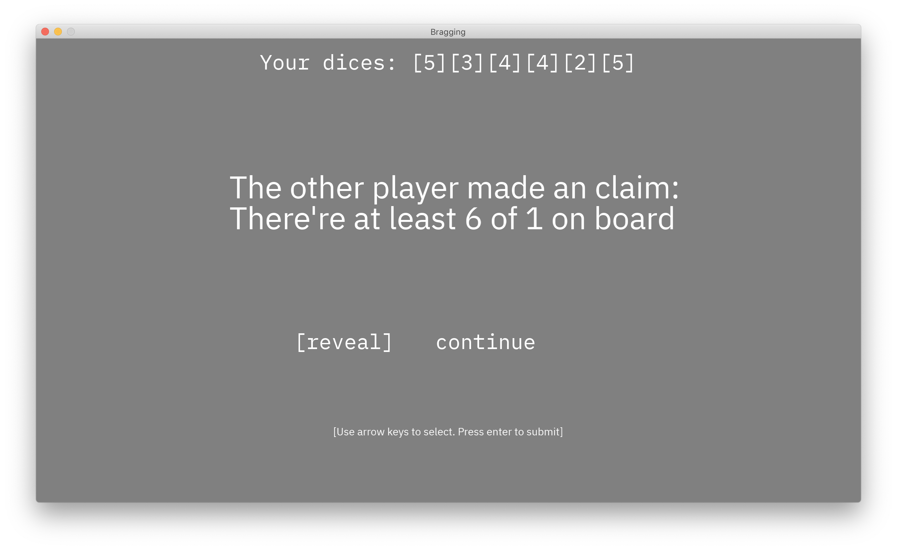

# Bragging

Author: 
Xiaoqiao Xu, Zizhuo Lin

This is a game inspired from the real-world board games. Given we are stuck at home, it's a good idea to move board games into the digital world.

Design: 
Each player has 6 dices and one of the player will make a claim on how many dices with certain face up are presented. The other player will have the choice to whether reveal the true state or make a new claim.

Networking: 
The Connection interface provided is used to transmit state messages. User action and required game state message is transmitted such as the dice state for a user and the claim other user made.

Screen Shot:

How To Play:
Controls of each step is introduced in the game. The strategy is to compare the claim and your dices to decide whether the claim is valid and reveal the true state if you think is invalid. If you think the claim is valid, you need to make a new claim back.

Sources: 
- IBM Plex Font (see license in `dist/`)
- Computer Modern Font (see license in `dist/`)

This game was built with [NEST](NEST.md).

